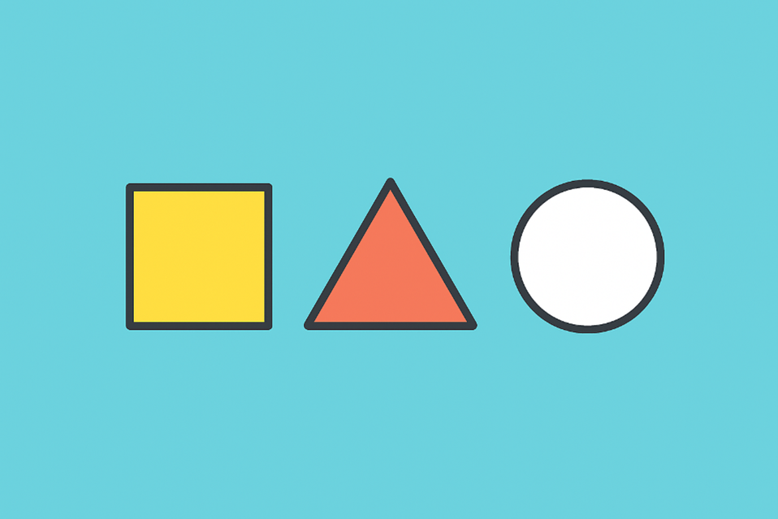

=====================
**1. Figury płaskie**
=====================

Figury płaskie to takie, mają tylko dwa wymiary – długość i szerokość.
Do najważniejszych należą:

-  **Trójkąt** – figura o trzech bokach i trzech kątach; suma jego kątów
   zawsze wynosi 180°.

-  **Kwadrat** – ma cztery równe boki i cztery kąty proste.

-  **Prostokąt** – przeciwległe boki są równe, a wszystkie kąty proste.

-  **Koło** – zbiór wszystkich punktów na płaszczyźnie w tej samej
   odległości od środka.

**Przykłady Figur płaskich**

1. Kwadrat
2. Trójkąt
3. Koło
